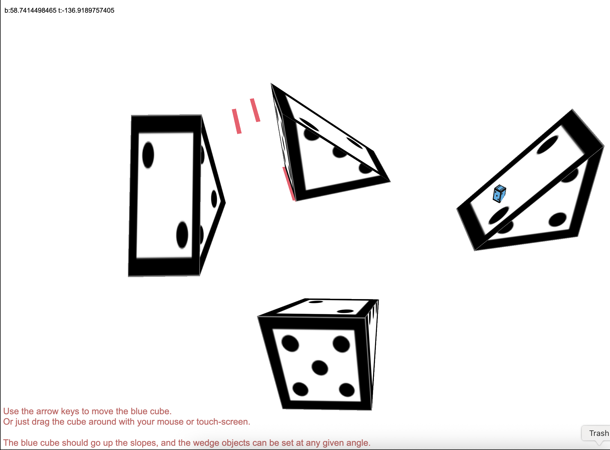

# 📐 Construct 3: 3D Slopes in any angle

This is a small improvement on the 3D slopes example originally shared by WackyToaster on the Construct forums:
[🔗 Original Forum Thread](https://www.construct.net/en/forum/construct-3/how-do-i-8/anyone-figured-go-3d-wedge-171152)

In that project, a 3D wedge shape was used to create sloped surfaces that other 3D objects could move up and down on. A very cool trick — but it came with a limitation: the slopes only worked correctly at fixed angles like 90°, 180°, 270°, and 360°.

You can see a more interesting implementation of this project in the basic versions of this related project: https://github.com/hielo777/3dThumbstickControls

  
   
  <a href="https://hielo777.github.io/3DSlopes/">
    Click here to try the demo >>
  </a>

***

### 🆕 What This Project Improves
This updated version removes that angle restriction!
Now, you can rotate your 3D wedge slopes freely to any angle, and everything still behaves as expected.

No more right-angle-only slopes — tilt them however you like!

***

### 🎯 Why This Matters
+ Smoother, more natural-looking terrain in your 3D Construct scenes
+ Greater flexibility in level design
+ A fun little dive into how math and 3D objects can work together in Construct

***

### 🛠️ What's Included
+ A working sample .c3p file demonstrating freely-rotated 3D wedge slopes
+ An html export, so you can check the Js code, if you want to
+ Simple, clean logic to apply to your own projects

***

## 🔀 Changes:
- [x] Moved all the html files to the `html export files` folder for easier project navigation
- [x] Added a *basic version* folder to keep the original functionality clean after upcoming additions

***

## 📋 To Do
- [ ] Create a "Basic version" folder to keep the current version
- [ ] Add better "falling functionality" that shows a better fall off the slopes from the sides. Current version is not too reliable
- [ ] Create another, friendlier version to showcase possible applications
- [ ] Allow the Player object to go on different levels

***

(<a href="#readme-top">back to top</a>)

